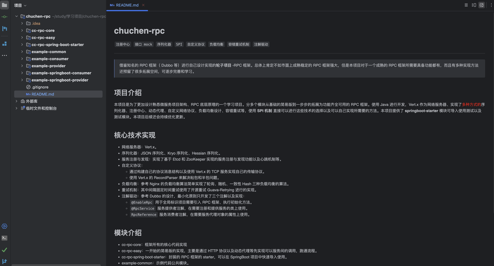
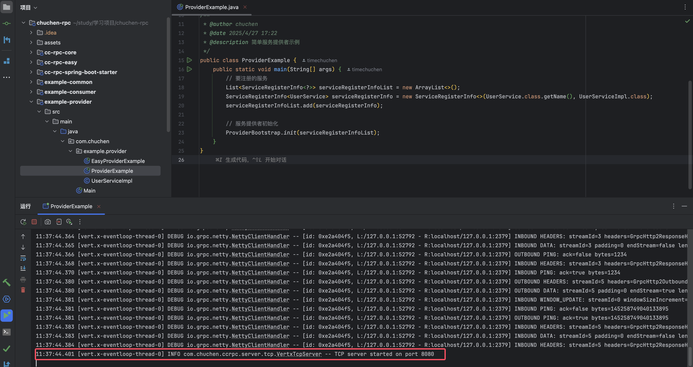
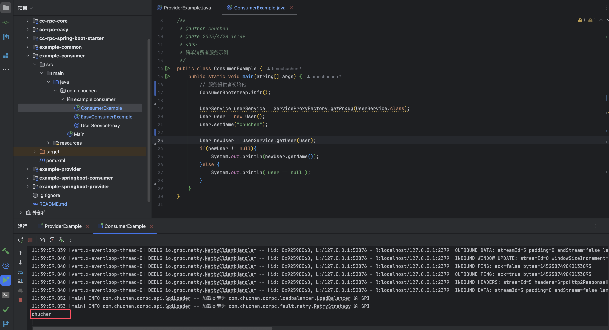
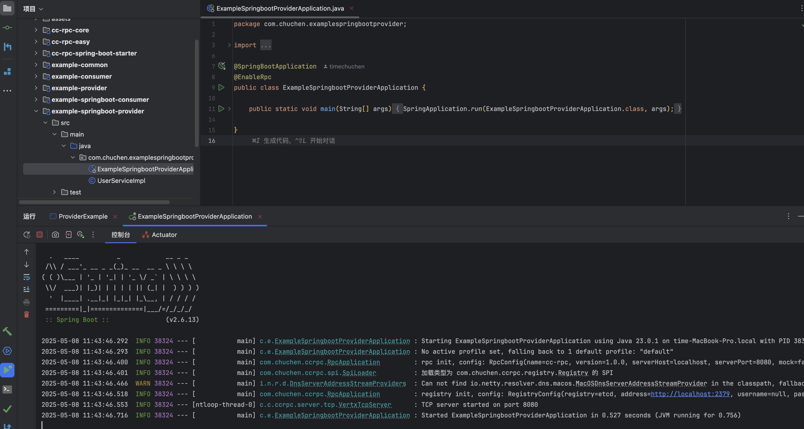
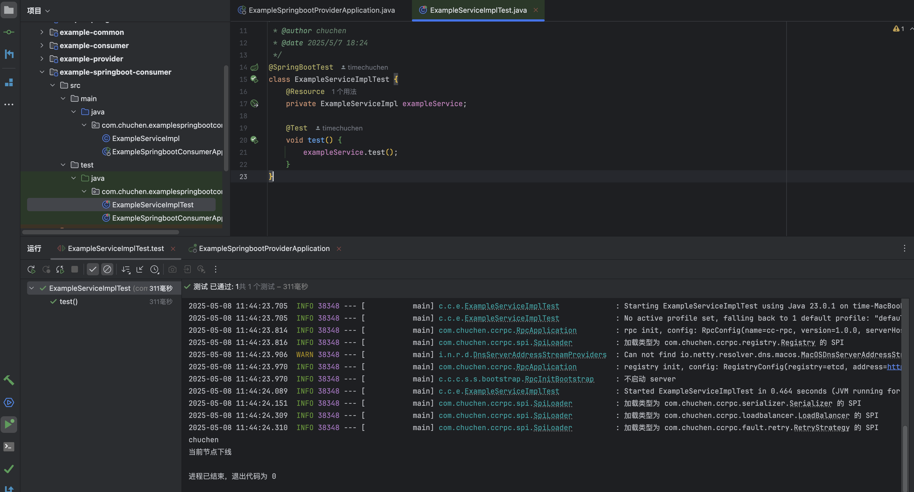

<h1 align="center" style="width: 20%; margin: auto; background-color:rgba(24, 184, 224, 0.616);; color: aliceblue; font-weight: 700;">chuchen-rpc
</h1>
`注册中心`  `接口 mock`  `序列化器`  `SPI` `自定义协议`  `负载均衡` `容错重试机制` `注解驱动` 

------

> 借鉴知名的 RPC 框架（ Dubbo 等）进行自己设计实现的**轮子项目** -RPC 框架。总体上肯定不如市面上成熟稳定的 RPC 框架强大，但是本项目对于一个成熟的 RPC 框架所需要具备功能都有，而且有多种实现方法还预留了很多拓展空间，可逐步完善和学习。

## 项目介绍

 本项目是为了更加设计熟悉微服务项目架构、RPC 底层原理的一个学习项目。分多个模块从基础的简易版到一步步的拓展为功能齐全可用的   RPC 框架。使用 Java 进行开发，Vert.x 作为网络服务器、实现了<span style="color: red">多种方式的</span>序列化器、注册中心、动态代理、自定义网络协议、负载均衡设计、容错重试等，使用 **SPI 机制** 直接可以进行这些技术的选择以及可以自己实现所需要的方法。本项目提供了 **springboot-starter**  模块可导入使用测试以及测试模块。本项目后续还会持续优化更新。

## 核心技术实现

- 网络服务器：Vert.x。
- 序列化器：JSON 序列化、Kryo 序列化、Hessian 序列化。
- 服务注册与发现：实现了基于 Etcd 和 ZooKeeper 实现的服务注册与发现功能以及心跳机制等。
- 自定义协议：
  - 通过构建自己的协议消息结构以及使用 Vert.x 的 TCP 服务实现自己的传输协议。
  - 使用 Vert.x 的 RecordParser 来解决粘包和半包问题。
- 负载均衡：参考 Nginx 的负载均衡算法简单实现了轮询、随机、一致性 Hash 三种负载均衡的算法。
- 重试机制：其中间隔固定时间重试使用了开源重试 Guava-Retrying 进行的实现。
- 注解驱动：参考 Dubbo 的设计，最小化原则只开发了三个注解以及实现：
  - `@EnableRpc`  用于全局标识项目需要引入 RPC 框架、执行初始化方法。
  -  `@RpcService` 服务提供者注解，在需要注册和提供服务的类上使用。
  -  `RpcReference` 服务消费者注解，在需要服务代理对象的属性上使用。

## 模块介绍



- cc-rpc-core：框架所有的核心代码实现
- cc-rpc-easy：一开始的简易版的实现，主要是通过 HTTP 协议以及动态代理等先实现可以服务间的调用，跑通流程。
- cc-rpc-spring-boot-starter：封装的 RPC 框架的 starter，可以在 SpringBoot 项目中快速导入使用。
- example-common：示例代码公共模块。
- example-consumer：示例服务消费者（启动类启动），包含简易版和功能齐全版的测试。
- example-provider：示例服务提供者（启动类启动），包含简易版和功能齐全版的测试。
- example-springboot-consumer：示例服务消费者（SpringBoot 框架中的注解驱动）。
- example-springboot-provider：示例服务提供者（SpringBoot 框架中的注解驱动）。

## 测试使用

### 1、导入项目

通过以下地址讲仓库克隆到自己本地使用 IDEA 开发工具打开。

```shell
git clone git@github.com:timechuchen/chuchen-rpc.git
```

### 2、启动并配置 Etcd 服务

**启动一个 [Etcd](https://github.com/etcd-io/etcd) 服务。** [下载链接](https://github.com/etcd-io/etcd/releases)

当然也可以通过 Docker 启动一个 Rtcd 服务：

```shell
docker run -d --name Etcd-server \
    --network app-tier \
    --publish 2379:2379 \
    --publish 2380:2380 \
    --env ALLOW_NONE_AUTHENTICATION=yes \
    --env ETCD_ADVERTISE_CLIENT_URLS=http://etcd-server:2379 \
    bitnami/etcd:latest
```

### 3、配置

不论是使用启动类模块测试还是使用使用 SpringBoot 框架的注解驱动模块都需要在服务提供者和服务消费者的配置文件中选择配置以下配置信息（默认是如下信息，可以选择需要更改的进行配置）：

```properties
rpc.name=ccrpc 
rpc.version=2.0
rpc.serverPort=8080
rpc.mock=false
rpc.serializer=json
rpc.registryConfig.registry=etcd
rpc.registryConfig.address=http://localhost:2379
rpc.serverHost=localhost
```

### 4、启动测试

- 启动类测试：

先启动 `example-provider` 模块的 `ProviderExample`  类来启动一个提供 UserService 的服务提供者的服务：



然后在启动` example-consumer` 模块的 `ConsumerExample` 类来进行调用测试：



- SpringBoot 注解驱动测试：

先启动 `example-springboot-provider` 的 SpringBoot 启动一个使用注解注册到服务中心的服务提供者案例项目：



然后启动  example-springboot-consumer 的SpringBoot项目的ExampleServiceImplTest 测试类进行测试



## 拓展优化